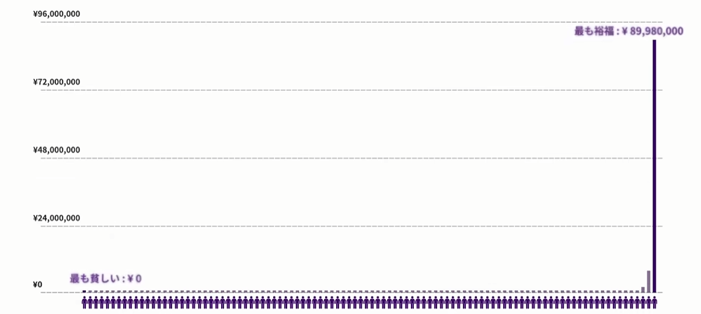
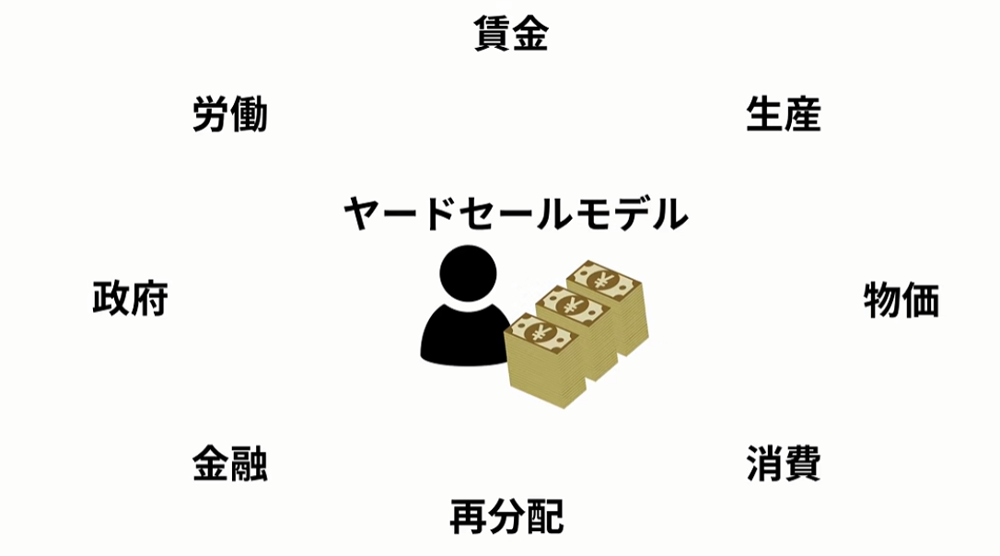

# ヤードセールモデル拡張仕様検討書（マクロ経済8要素 循環型モデル）

## 1. 概要と目的

### 1.1. 現行ヤードセールモデルの挙動
純粋なヤードセールモデル（Yard-Sale Model）では、エージェント同士が資産比例または小口のコイントス取引（勝率50%のゼロサム取引）を繰り返すことで、数学的必然として**富が1人に独占される「オリガルヒ化（格差の凝縮）」**が発生する。



### 1.2. 拡張の目的とロードマップ
現行のシナリオ作成時は、最小限の環境設定（**人口・初期資産・最大ターン数**）のみを入力対象とし、余計な設定を排除した純粋ヤードセールモデルとして動作させます。
その上で、将来的には以下の3大拡張モジュールを段階的に追加できるように設計します：

1. **初期資産分布モジュール (Distribution)**:
   - 全員一律の公平初期値だけでなく、ジップ則・パレート則・正規分布・階層初期格差（富裕層3倍/貧困層0.2倍など）を設定可能にする。
2. **個性モジュール (Personality)**:
   - 好戦的（戦闘率n倍）、消極的（待機率n倍）、弱者攻撃（資産下位を優先対戦）、強者挑戦（資産上位を優先対戦）などのエージェント行動特性（`51_parsonal.md` 連携）。
3. **マクロ経済8要素 循環モジュール**:
   - 賃金、生産、物価、消費、再分配、金融、政府、労働による実体経済循環を導入し、完全定常（格差ゼロ維持）および制度介入効果を検証。



---

## 2. 8要素の定義と循環アーキテクチャ

各要素の役割と相互関係を以下のように定義する。

```text
               ┌────────── 【政府 (Government)】 ──────────┐
               │ 徴税 (Tax)                       再分配 (UBI/給付) │
               ▼                                            │
        ┌─────────────┐        労働力提供 (L)        ┌─────────────▼┐
        │ 労働 (Labor) │ ──────────────────────────► │ 生産 (Production)
        └──────┬──────┘                              └──────┬──────┘
               │ 賃金支払 (Wage)                             │ 財・サービス供給
               ▼                                            ▼
        ┌─────────────┐       消費支出 (P * C)       ┌─────────────┐
        │ 賃金 (Wage)  │ ──────────────────────────► │ 物価 (Price) │
        └──────┬──────┘                              └──────┬──────┘
               │ 預金・借入                                  │ 売上還流
               ▼                                            ▼
        ┌─────────────┐                              ┌─────────────┐
        │ 金融 (Finance)│ ◄─── 余剰資金 / 利息 ──── │ 消費 (Consumption)
        └─────────────┘                              └─────────────┘
               ▲
               │ ※ 余剰資金を用いて「ヤードセール市場取引（投資・事業・投機）」が発生
               └─────────────────────────────────────────────────────────────
```

### 各要素の定義

| 要素 | 分類 | 定義と役割 | 影響を受ける変数 |
| :--- | :--- | :--- | :--- |
| **① 労働 (Labor)** | 行動・供給 | エージェントが提供する労働時間・体力・稼働量。 | 労働供給量 $l_i \in [0, 1]$、就労状態 |
| **② 賃金 (Wage)** | 所得・分配 | 労働の対価として支払われる基本給与・報酬。 | 労働生産性 $s_i$、基本賃金率 $w$ |
| **③ 生産 (Production)**| マクロ供給 | 投入された総労働力から生み出される財・サービスの総量。 | 総生産量 $Y = \sum (s_i \cdot l_i)$、技術水準 $A$ |
| **④ 物価 (Price)** | 市場均衡 | 総貨幣需要と総生産供給のバランスにより決定される財の単価。 | 物価水準 $P_t$、インフレ/デフレ率 |
| **⑤ 消費 (Consumption)**| 支出・効用 | エージェントが生存・生活のために購入する財の量と支出額。 | 最低生存費 $c_{\min}$、限界消費性向 $mpc_i$ |
| **⑥ 金融 (Finance)** | 資本・利息 | 預金に対する金利収入、借入に対する金利支払い、投資運用。 | 預金金利 $r_d$、借入金利 $r_b$、借入可能枠 |
| **⑦ 政府 (Government)**| 公共・統制 | 経済から税を徴収し、財政運営と制度維持を行う主体。 | 租税総額 $T$、政府支出 $G$、財政収支 |
| **⑧ 再分配 (Redistribution)**| 社会保障 | 所得税・富裕税を原資とし、UBIや困窮者支援として還元する仕組み。| UBI給付額、累進課税率、困窮救済閾値 |

---

## 3. 1ターンの経済循環フロー（ステップ処理）

各ターンは以下の6フェーズで順次実行される。

### Phase 1: 労働・生産・賃金決定フェーズ
1. **労働供給**: 各エージェント $i$ は自身の個性（勤勉度・健康度）に基づき労働量 $l_i$ を供給。
2. **総生産算出**: 経済全体の総生産 $Y_t = A_t \sum_{i=1}^N (s_i \cdot l_i)$ を決定（$A_t$ は技術係数）。
3. **賃金受給**: 企業/市場からエージェントへ基本賃金 $W_i = w_t \cdot s_i \cdot l_i$ が支払われる。

### Phase 2: 物価決定・基礎消費フェーズ
1. **物価水準更新**: 総有効需要と総生産 $Y_t$ から当ターンの物価 $P_t$ を算出（$P_t = \text{Demand} / Y_t$）。
2. **生活消費支出**: 各エージェントは生存必要消費 $c_{\min}$ および追加消費 $C_i$ を購入し、金額 $P_t \cdot C_i$ を支払う。
   - 支払われた消費資金は生産者プール（企業売上）へ還流する。

### Phase 3: ヤードセール市場取引（事業・商取引・不確実性）
- 生活消費後の**余剰資産（可処分余剰金）**を対象に、エージェント間でペアマッチング取引を行う。
- 従来モデルのコイントス勝敗により、富の移転 $\Delta \text{Wealth}$ が発生。
- ※ 個性パラメータ（好戦的/消極的、リスク許容度）により取引参加可否・賭け金率が変動。

### Phase 4: 金融・利息フェーズ
1. **資産保有者**: 資産を銀行/金融市場に預託し、預金金利 $r_d \cdot \text{Wealth}_i$ を獲得。
2. **債務保有者**: 借入があるエージェントは借入利息 $r_b \cdot \text{Debt}_i$ を支払い。

### Phase 5: 政府・租税・再分配フェーズ
1. **徴税**:
   - 累進所得税: 高額賃金・市場利益に対する課税。
   - 資産課税（富裕税）: 一定以上の資産保有者に対するストック課税。
   - 消費税: Phase 2 の消費額に対する一定率課税。
2. **再分配**:
   - ベーシックインカム（UBI）: 全員に均等給付 $U$。
   - 困窮者給付: 最低生活費を下回った層へのセーフティネット救済。

### Phase 6: 資産確定・生存判定フェーズ
- 最終資産 $\text{Wealth}_{i, t+1} = \text{Wealth}_{i, t} + W_i - (P_t \cdot C_i) \pm \Delta \text{Wealth}_{YS} + \text{利息} - \text{税} + \text{給付}$ を計算。
- 資産および消費水準が生存閾値を下回った場合、貧困脱落判定。

---

## 4. 経済モデルとして差異が発生しない構成（ベースライン）

「格差が不可避的に拡大しない」完全な定常均衡状態（Steady State）を基準点（Benchmark）として設定する。

### 4.1. 差異ゼロ（Gini = 0 恒等維持）の数理条件

| 条件項目 | 設定内容 | 理由・効果 |
| :--- | :--- | :--- |
| **① 能力・労働の同一性** | 全員 $s_i = 1.0, l_i = 1.0$ | 賃金格差の発生要因を排除 |
| **② 収支の完全一致** | 賃金 $W_i =$ 生活消費 $P \cdot C_i$ | 純貯蓄・純損失の恒常的ゼロ化 |
| **③ 金利ゼロ** | 預金金利 $r_d = 0$, 借入金利 $r_b = 0$ | ピケティ型資本収益率（$r > g$）による格差拡大を排除 |
| **④ 物価の定常性** | $P_{t+1} = P_t = 1.0$ | 実質購買力の目減り（インフレ税）を排除 |
| **⑤ 取引の排除 or 完全保険** | ヤードセール取引不参加、または市場取引利益に100%課税・完全UBI還流 | 運（コイントス）による非対称蓄積の完全遮断 |

**結果**: 毎ターン全エージェントの資産が初期値 $W_0$ のまま一切増減せず、ジニ係数は永続的に $0.000$ を保つ。

---

## 5. 個性を付与して差異を持たせる設計（Agent Personality）

ベースラインに対して、エージェント個々の特性（パラメーター分布）を付与することで、現実的な経済格差の発生要因を分離・検証する。

```typescript
interface AgentPersonalityProfile {
  id: number;
  // 1. 労働・生産特性
  skillLevel: number;        // スキル水準 (0.5 〜 2.5): 賃金率・生産性に直結
  diligence: number;         // 勤勉度 (0.5 〜 1.2): 労働供給時間 l_i

  // 2. 消費・貯蓄特性
  marginalPropensityConsume: number; // 限界消費性向 (0.3 〜 0.95): 稼いだお金をどれだけ消費に回すか
  frugality: number;         // 倹約性 (低ければ基礎消費以外に贅沢品消費を行う)

  // 3. 取引・リスク特性（ヤードセール行動）
  riskAppetite: "aggressive" | "conservative" | "neutral"; // 好戦的 / 消極的 / 中立
  betRateMultiplier: number; // 賭け金倍率 (0.5倍 〜 2.0倍)
  targetSelectionRule: "random" | "hunt_weak" | "challenge_rich"; // 弱者攻撃 / 強者挑戦 / ランダム

  // 4. 金融リテラシー
  financialLiteracy: number; // 余剰資産の運用効率・借入リスク回避力
}
```

### 個性によって生じる差異のメカニズム

1. **スキル差（能力格差）**:
   - スキルが高い人は賃金所得 $W_i$ が多く、自然と貯蓄余力が生まれる。
2. **消費性向差（生活格差）**:
   - 倹約家は資産を積み増し、浪費家は高所得でも貯蓄がゼロ近くにとどまる。
3. **好戦性差（市場リスク）**:
   - 好戦的なエージェントはヤードセール取引に頻繁に参加し、勝者になれば急激に富豪化し、敗者になれば短期間で破産・転落する（ボラティリティの増大）。
4. **資本蓄積（複利効果）**:
   - 貯蓄余力のある層は金融利子によって労働せずとも資産が増加する（$r > g$ の発現）。

---

## 6. シナリオConfig定義案（拡張JSONスキーマ）

```json
{
  "macroEconomy": {
    "enabled": true,
    "baseWage": 1000,
    "technologyLevel": 1.0,
    "priceElasticity": 0.5,
    "subsistenceCost": 800,
    "depositInterestRate": 0.02,
    "borrowInterestRate": 0.05
  },
  "governmentPolicy": {
    "incomeTaxType": "progressive",
    "progressiveTaxThreshold": 15000,
    "progressiveTaxRate": 0.15,
    "wealthTaxRate": 0.01,
    "consumptionTaxRate": 0.08,
    "ubiAmount": 300,
    "safetyNetThreshold": 500
  },
  "marketExchange": {
    "yardSaleWeight": 0.3,
    "betRatio": 0.05,
    "strongAdvantage": true
  },
  "diversitySettings": {
    "skillDistribution": "lognormal",
    "consumePropensityRange": [0.4, 0.9],
    "personalityDistribution": {
      "aggressive": 0.25,
      "conservative": 0.25,
      "neutral": 0.50
    }
  }
}
```

---

## 7. 検証実験シナリオ（What-Ifマトリクス）

本拡張機能により、以下のテーマを比較検証可能となる。

| 実験シナリオ | 条件設定 | 検証仮説・観察ポイント |
| :--- | :--- | :--- |
| **実験1: ゼロ格差定常社会** | 個性均一、金利0、ヤードセール停止、再分配なし | 経済循環が100%回り、ジニ係数がターン経過に関わらず $0.00$ を維持できるかの検証。 |
| **実験2: 純粋能力主義社会** | スキルに格差あり、ヤードセール停止、再分配なし | 「運」を排除しても、個人の能力差・生産性差だけでどれほどの格差・階層固定が生じるかの検証。 |
| **実験3: 純粋運社会（現行モデル）** | スキル均一、ヤードセール全開、実体経済なし | 労働・生産が存在せず、コイントス市場のみで富が1人に凝縮する現象（再現）。 |
| **実験4: 混合実体経済社会** | スキル差あり、ヤードセール並行、金融利子あり | 労働所得による基盤と、市場投機・資本利子による格差拡大が複合した現実経済のシミュレーション。 |
| **実験5: 最適福祉・再分配社会** | 実験4の環境 ＋ 最適累進課税 ＋ UBI | 個性の違いによるインセンティブ（生産意欲）を損なわずに、破産脱落と過度のオリガルヒ化を防ぐ税・給付水準の特定。 |
